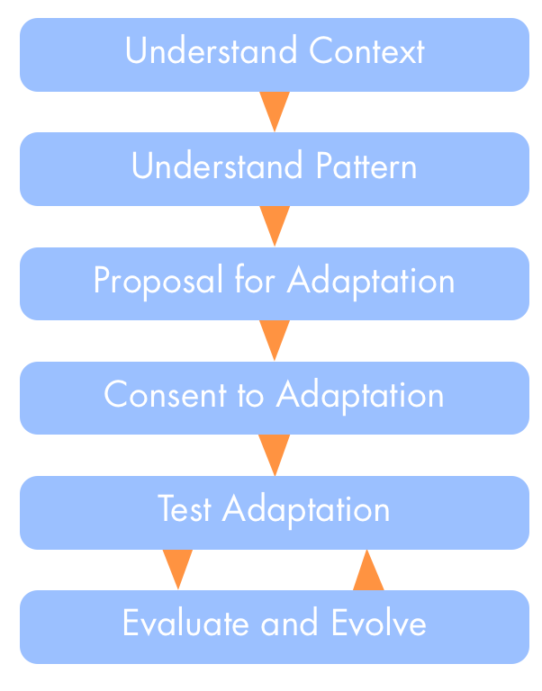

Patterns are merely ideas that worked for somebody somewhere, in their culture, their perception of the world, their strengths and growing edges. Your context is certainly different, so if you simply copy and paste a pattern, it might not work for you. This is why you sometimes need to adapt a pattern to your context. 

  
## Context for Successful Application:

In order to successfully adapt a pattern, a circle needs to develop shared understanding of both the pattern and their specific context. In almost every case it makes sense to gather the circle for this, to ensure both buy-in of all circle members and availability of all the knowledge and experience present in the circle. Often it's a good idea for everyone to review the pattern before the workshop.

  
## Application

The basic steps of the process of adapting a pattern are very simple, and can be implemented in various levels of detail:

* develop shared understanding of the pattern and your context
* co-create an adaptation of the pattern
* evaluate effectiveness and evolve your adaptation
* share your experience with others, and consider feeding back successful adaptations to the S3 handbook

### Understand the Pattern and Your Context ###

Here's a set of activities to guide you, pick those you find valuable for you. It's up to the facilitator to facilitate them in rounds or as a brainstorming, and to visualize all the results in a way they can be seen by all participants. Give space for questions, so at the end everyone feels they understand the outcome.

* What is the **problem the pattern aims to solve**? How does this match to your driver for seeking out this pattern? Note similarities and differences. 
* What is the **context for successful application** of the pattern? List both the common ground and the differences to your context? 
* If the pattern describes **variants**, determine which variant might be the best fit for you. It is this variant you would attempt to adapt first.
* Does your context match one or several of the **known limitations** or disadvantages of a pattern? Make a note which ones.
* If the pattern description lists **advantages**, mark the ones you would want to preserve.
* If the patterns contains **references** to other patterns, go and see if they contain something  to help you.
* How does the pattern relate to each of the **seven principles behind S3**? Note what is important and should be preserved.

### Co-Create an Adaptation of the Pattern ###

A simple an effective way for creating an adaptation of a pattern is [Proposal Forming](proposal-forming.md), where you can use the output of the first phase as considerations or ingredients for your adaptation.

Considering [Intended Outcome](intended-outcome.md) and [Evaluation Criteria](evaluation-criteria.md)  of your proposed adaptation will help you evaluate and evolve the patterns later.

The proposal needs to be agreed upon by the circle, e.g. by using [Consent Decision Making](consent-decision-making.md)

## Variants ##

If you feel that everyone has a solid understanding of the context and the pattern anyway, e.g. because you are already using it for a while and experience limitations, you might skip the first part and go right into *Proposal Forming*.

A circle might also appoint one or several members to create a proposal for an adaptation in any way they see fit, e.g. by using the activities for understanding pattern and context suggested above, and then present the proposal to the circle, e.g. in the [Navigation Meeting](navigation-meeting.md).

## Known Limitations ##

Adapting patterns works best when everyone involved is invested in understanding S3 principles, the pattern in question and the context of the circle. Some circles have a culture of high resistance to things they did not develop themselves, or they have pain points or blind spots which make it difficult to approach some patterns with an open mind.

