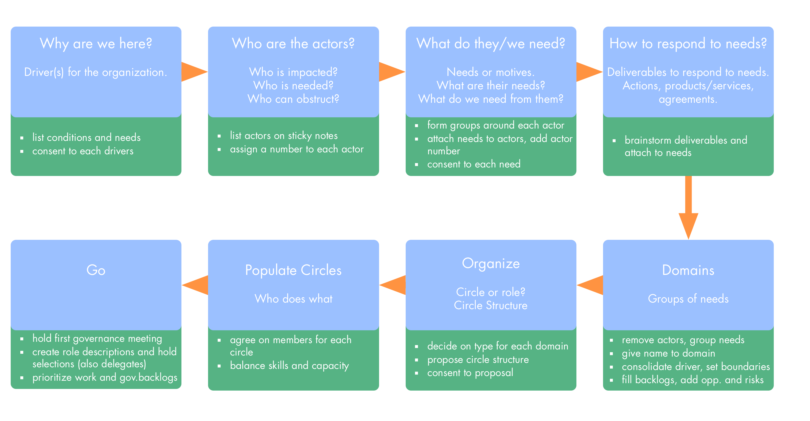

Driver mapping is a workshop format for identifying organizational structure within a domain or  an entire organization. It's based on *Impact Mapping* by Gojko Adzic, but focussed more on flow of value and information, instead of actual deliverables (identifying deliverables is the accountability of the respective domain).

The result of driver mapping is organizational structure aligned to the pull of external and internal actors, e.g. customers/users, partners, members, communities and municipalities.

Depending on the size of the organization, department or team affected, driver mapping will have to be facilitated in a different way.

Most of the activities described below are suitable for groups of 10-15 people (depending maturity of the group and skill of the facilitator), for larger groups consider having participants self-organize into groups of up to five people, and add activities to consolidate input of the groups and consent to the result.

The implementation of driver mapping explained below is just one way to implement it, make sure to adapt it to your specific needs, e.g. using [Adapt Patterns To Context][].

## Step 1: Why are we here?

Understand the driver(s) for the organization, and describe it in terms of needs and conditions and consent to each driver. Output of this phase is one or more posters with details on the driver(s).

* focus on completeness and shared understanding, but don't waste time on writing elegant statements, this is a task for later
* get input for both internal and external view on the driver(s)

Generative questions:

* individual perspective (first): "why are you with this organization?" and "what is it  you wish for?"
* organizations perspective (second): "why are we here?"

When working with subgroups for the activities, collect the individual perspective first and share with the whole group before working on the organizational perspective. Instruct subgroups to only share *what* people said, but not to link it to *who* said it.

## Step 2: Who are the actors?

List actors and stakeholders pulling on the organization. Actors can be individuals or groups, also the organization itself, or parts of it, as well as individual members.

Output of this step is a collection of all relevant actors, each on a separate sticky note or card (use the same color for all actors).

Generative questions:

* Who is affected?
* Who is needed?
* Who can support or impede?

At the end, assign a number to each actor.

## Step 3: What do they need?

Collect needs and motives.

Output of this step is a collection of needs on sticky notes (use the same color for all needs).

Generative questions:

* What are the needs of each actor?
* What do we need from them?

* add needs on sticky notes to each actor and add the actor’s number to each one
* with large group: form smalls group around each actor
* make sure group consents to each need, explicitly ask them to seek out needs they don't agree with and resolve the resulting objections

## Step 4: Identify Domains

Group needs into (semi-)autonomous domains.

Output of this step is a set of posters with domains, which will later be implemented as circles, roles, or, in some cases, agreements.

Remove actors cards and and group needs into logical clusters, those are your domains.

Move each group to a poster and agree on a meaningful name for each domain.

Add boundaries, or other relevant bits of information popping up (risks, questions etc.) on sticky notes to the domains.

## Step 5: Organize

Agree on circle structure for domains.

Output of this step is an agreement on how domains will be connected and coordinated (if necessary), as well as the type (circle, role, agreement) for each domain.

Create a proposal for circle structure (including roles, if any), include delegate circles, coordination circles and service circles to link domains as needed. 

Use proposal forming, or proposal forming for large groups (collect considerations and ideas in small groups and send delegates) to build the proposal.

Consent to proposal and integrate any objections you encounter. 

Add role selections and emerging items to governance backlogs of each domain, and assign the review for the circle structure to the appropriate domain.

## Step 6: Populate circles

Find members for each circle

Output of this step is a list of members for each circle.

Generative question:

* Who can contribute to which circles?

People add their name on a sticky note to circles they think they can contribute to effectively, taking into account the their skills and other relevant factors. Should some people decide to be part of several circles, they are accountable for balancing their available time. 

## Step 7: What do we need to run safely?

Circles meet and make sure their circle is able to respond to its driver effectively.

Output of this phase is a collection of proposals for amending circle structures and circle membership, as well as open questions, work items and governance items for each circle.

Have each circle gather around their domain poster and review the domain's viability, both as a (semi-)autonomous unit and in relationship to the rest of the organization.

Identify...

* missing resources or skills or capacity
* unclear boundaries or scope of the circle
* open questions
* required handovers or tasks for transitioning from the previous structure (if any)
* risks, challenges, impediments and opportunities

...and add them as work items or governance items to the circle poster.

When facilitating this step, visit each circle to support them, and remind participants to visit all the circles they are members of.

Circles create proposals for adapting circle structure or circle membership if necessary, and present them to the whole group. Amend circle structure as needed. 

## Step 8: Welcome your new organization

Celebrate your new organization, and agree on start and review date. 

Output of this step is an agreement when the new circle structure will be implemented, when it will be reviewed, and who will guide the process.

## What's next? 

Here's a list of things the new circles will have to do, e.g. in their first governance meeting, before they can start working:

* Prioritize work and governance backlogs
* Refine description of the circle's driver, explain conditions, set clear boundaries/define scope of domain
* Identify deliverables (tasks, products/services) and reasonable expectations for responding to the circle's driver,  and add them to either the work backlog (work items, clear, well-defined) and governance backlog (meta-items, large, uncertain, impact on way of working)
* Brainstorm challenges, impediments, risks and opportunities for each domain and add to governance backlog.
* Create role descriptions and hold selections for roles (including delegates)
* Make a plan for handover and transition from the previous structure

