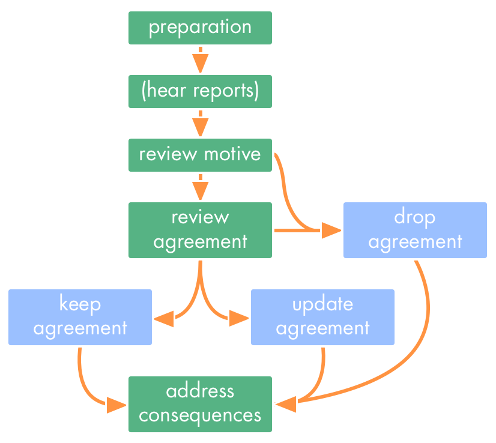

A pattern for ensuring agreements remain effective.

**Motivation for this pattern:** To keep an organization's or team's body of agreements effective in the face of emerging knowledge and changes in context, each agreement needs to be periodically reviewed and updated.

**Agreements**[^agreement-policy] guide action and behavior. They are created as a response to a specific situation that affects an organization or team.  

Team and organization wide agreements are kept up-to-date with what is happening, what is learned, and how expectations compare to actual outcomes. 

[^agreement-policy]: in some organizations these agreements are referred to as a "policy").

## Indicators for this pattern

**Conditions:**

* existing agreements don't make sense any more (out of date, slow, rigid, ineffective)
* lack of clarity about why things are done in certain ways and what outcomes an agreement is meant to have
* lack of opportunities taken to integrate new learning and improve

**Needs:**

* adapting to changes in the inner and outer environment of the organization
* improve and evolve agreements previously made
* integrate learning from new experiences

## The Details

Changes in context can make an agreement less effective or even obsolete. Putting an agreement into action often reveals new ways an agreement can be improved.

Organizations or teams periodically evaluate their agreements, usually in periodical meetings, or even a dedicated workshop to review a complex agreement (e.g. an organization's values or strategy).

Evaluating agreements has **four basic steps**:

1. preparation
2. hear reports (optional)
3. the actual review 
4. addressing any consequences

### Step 1 - Preparation

Preparing for the review helps to keep it brief and effective.

Inform everyone affected of the upcoming review and make sure they have access to documents describing the agreement and its iterations, and if applicable, data relating to evaluation criteria and metrics.

Ensure all documents related to the agreement are up to date, and reports are prepared (see next step).

### Step 2 - Hear Reports

For more complex agreements its useful to have a temporary "owner" who is familiar with the agreement and its effects. They review the evaluation criteria and other data and prepare a short report.

In some cases it may require several people to prepare and present a report.

The report is presented immediately before the actual review.

### Step 3 - The Review

The review itself is often split in two parts:

* review of the motive for the agreement
* review of the agreement itself

#### Review the motive

In order to prime the group about the context, it's a good idea to first review the motive for creating the agreement, i.e. needs or requirements the agreement should address, and the conditions or context in which the needs or requirements were identified. 

If an agreement does not contain a description of the motive, this may be a good time to collaborate on describing it.

Helpful questions to review the motive include:

* *Is the description of the motive still accurate, or does it need to change?* (e.g. because we changed the conditions, learned something, or discovered something else is needed)
* *Is this situation still relevant for the organization or this team?*

**Sometimes the review ends here**, because:

* the authority to respond to the situation falls to someone else: Pass it to relevant team or individual
* the motive for  agreement no longer exists or ceased to be relevant: Close the agreement 

In both cases, address any consequences (Step 4).

#### Review the agreement ####

Review the agreement itself in its latest form by asking these questions:

*Considering any reports heard, the updated understanding of conditions and needs and what is known today:*

* *Is the agreement still good enough for now and safe enough to try?*
* *Do you see any reason why NOT to continue with this agreement in its current form?*
* *Are there any concerns about this agreement?*

Depending on the answers to these questions there are several possible outcomes:

1.  keep the agreement without change
2.  use what's learned to update the agreement on the spot, or, for more substantial changes, schedule a separate session for the update 
3.  drop the agreement

In all cases, consider recording answers and concerns for future evaluations, and **agree on a next review date.**

### Step 4 - Addressing any consequences

After the review, ensure consequences of any decisions are dealt with. 

This may include:

* assigning tasks
* recording the latest version of the agreement
* updating other agreements affected by decisions made
* sharing results with those affected by the decision
* scheduling further pending decisions if required

### Considerations for an effective review process

Use the idea of **falsification** instead of merely focusing on what would make an agreement a success. Describe what would need to happen to consider that it failed. This information can be used to describe the intended outcome, and to define criteria for evaluation.

Adjust the review cadence according to the stability of the agreement.

Consider having an early review when people affected by the agreement raise concerns or explain reasons why continuing without change may not be effective, or how changing the agreement could improve effectiveness.

## Related patterns

Agreements are evaluated in [Governance Meetings][governance-meeting.md] by the [Circle][circle.md] that created them.

The description of an agreement can include the [Driver](driver.html) it responds to, the [Agreement](agreements.html) itself, any [Intended Outcomes][intended-outome.md] and [Evaluation Criteria](evaluation-criteria.html).

In Step 2 people review the [Driver](driver.html) behind an agreement.

In Step 4 [Consent Decision Making](consent-decision-making.html) can be used to test the agreement. 

If the circle decides a new agreement is needed, its members might use [Proposal Forming](proposal-forming.html) to come up with one.
