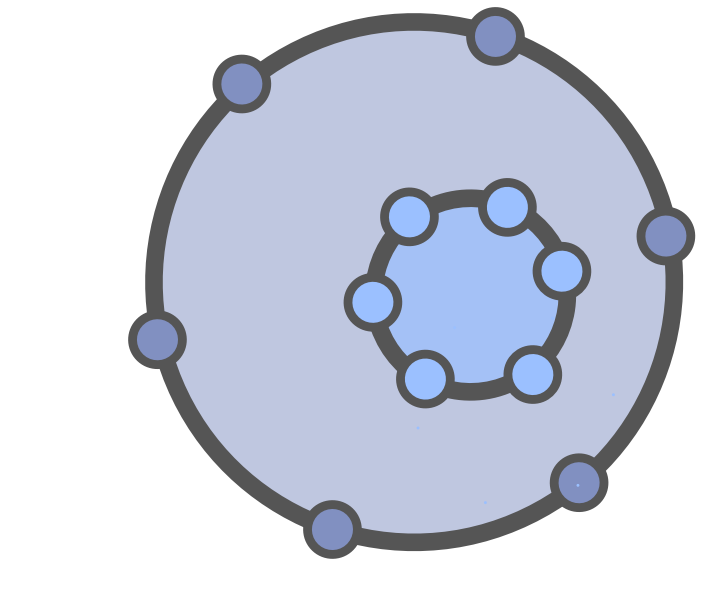

**Motive*: a circle requires a clearly defined service, but has not enough capacity.

A group of people with the mandate to execute on rules and guidelines set by the circle that encloses or "owns" the helping circle. 

Within the boundaries defined by the rules and guidelines the helping circle might self-organize, or work with a coordinator or leader. A helping circle usually has no navigation meeting, but may raise objections to rules and guidelines to the parent circle.

