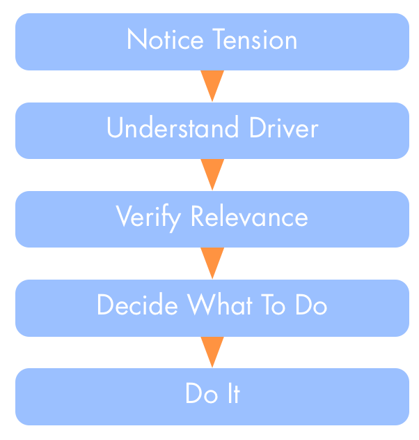

**Definition**:  _A tension is the subjective experience of contradiction between reality and that which we desire or anticipate._

* individuals act as sensors for the organization
* tensions arise whenever our perception of what is happening is in conflict with our **expectations** or our **values** (and principles)
* problems, challenges, and feelings of unease are all tensions
* investigating tension leads to the discovery of drivers
* to identify a possible driver behind a tension we:
    * **describe** the situation
    * **identify** the needs we associate with it 
* in the process, a tensions may be resolved as **misconceptions**

